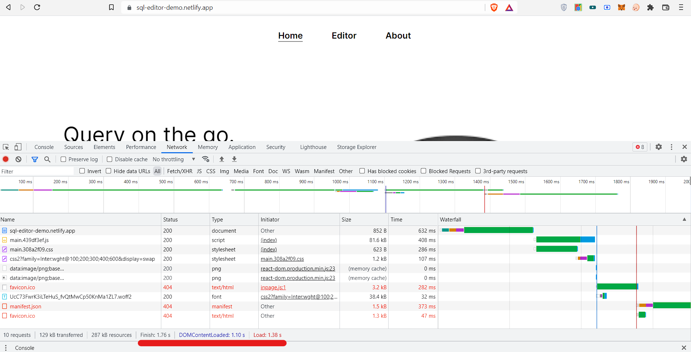

# Calculating load time:

## 1. Devtools
One method to calculate page load time is to use devtools network option.
In the picture shown below I have marked the load time with red underline. 
This time shows the total period to download files and load.



## 2. Vanilla JS code

Using the following code the time required to display the root html page of react is calculated 

```
var before_loadtime = new Date().getTime();
window.onload = Pageloadtime;
export function Pageloadtime() {
  var aftr_loadtime = new Date().getTime();
  // Time calculating in seconds
  var pgloadtime = (aftr_loadtime - before_loadtime) / 1000;

  console.log(pgloadtime);
}

```


# To run the app use following instructions:


## Getting Started with Create React App

This project was bootstrapped with [Create React App](https://github.com/facebook/create-react-app).

## Available Scripts

In the project directory, you can run:

### `npm start`

Runs the app in the development mode.\
Open [http://localhost:3000](http://localhost:3000) to view it in your browser.

The page will reload when you make changes.\
You may also see any lint errors in the console.

### `npm test`

Launches the test runner in the interactive watch mode.\
See the section about [running tests](https://facebook.github.io/create-react-app/docs/running-tests) for more information.

### `npm run build`

Builds the app for production to the `build` folder.\
It correctly bundles React in production mode and optimizes the build for the best performance.

The build is minified and the filenames include the hashes.\
Your app is ready to be deployed!

See the section about [deployment](https://facebook.github.io/create-react-app/docs/deployment) for more information.
